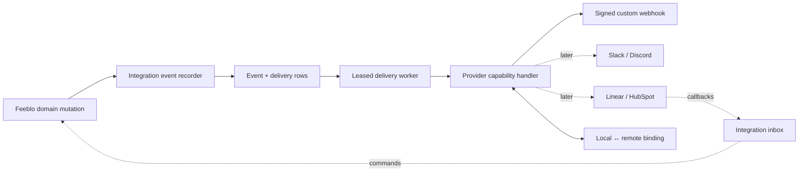

# Integration Platform Architecture: Signed Webhook V1 and Provider Roadmap

## Summary

Build a small integration platform with a provider-neutral event and delivery kernel, then ship signed custom webhooks as the first provider.

The architecture should support Slack, Discord, Linear, HubSpot, and later bidirectional synchronization without turning V1 into a runtime plugin system or a generic Zapier-style workflow engine.



The kernel owns canonical events, connections, routes, durable delivery, retries, secrets, history, and observability. Provider packages own authentication, payload rendering, API calls, signatures, wire schemas, and provider-specific failure classification.

External delivery is asynchronous. An external outage must never roll back or delay the originating Feeblo mutation.

## Merged Decisions and Terminology

Use these concepts consistently:

- **Provider** — an integration family such as webhook, Slack, Discord, Linear, or HubSpot.
- **Connection** — authenticated access to one external account/workspace. For the custom-webhook provider, one configured endpoint is one connection.
- **Capability** — a provider feature such as `events.post`, `channel.notifications`, `issue.create`, or `issue.sync`.
- **Route** — one configured instance of a capability, including event selection, filters, destination choices, mappings, and field policies.
- **Event** — an immutable, versioned fact emitted by the Feeblo domain.
- **Delivery** — one durable execution of an event against a matching route.
- **Binding** — the durable relationship between one Feeblo entity and one remote entity for bidirectional synchronization.

Specific naming decisions:

- `Route` is the canonical domain and database term. A webhook “subscription” is a route; do not add a parallel `integration_subscription` abstraction.
- Use `organizationId` at existing application and persistence boundaries, backed by the repository's branded `WorkspaceId` where that is already the identifier type.
- V1 public event names are `feedback.post.created` and `feedback.post.status_changed`.
- `webhook.test` is a separate, non-subscribable event used only by the dashboard Test action.
- Keep member notifications, activity history, and integrations separate:
  - `NotificationService` creates member inbox notifications.
  - `PostActivity` records user-visible audit history.
  - `IntegrationEvent` records immutable facts intended for external delivery.

## Scope and Non-Goals

### V1 scope

Ship only outbound signed custom webhooks:

- Post-created and post-status-changed events.
- Event-type selection without arbitrary workflow composition.
- Durable at-least-once delivery with best-effort ordering.
- Endpoint management, testing, secret rotation, delivery history, and manual retry.
- Production-grade signing, redaction, SSRF protection, leases, retries, and observability.

### Explicit non-goals

- No runtime-loaded plugins or integration marketplace.
- No generic workflow/automation graph.
- No Kafka or dedicated workflow engine; PostgreSQL remains the coordination system.
- No synchronous provider call inside a domain mutation.
- No inbound custom webhooks or universal two-way sync in V1.
- No historical backfill when an endpoint or route is created.
- No plan entitlement or pricing quota in V1; authorization and worker backpressure still apply.

## Monorepo Structure and Dependency Direction

Every integration module is an independent package under a dedicated top-level `integrations/` directory. Register that directory in `pnpm-workspace.yaml` so the core and provider packages participate in normal workspace dependency resolution, filtering, type-checking, and builds.

```yaml
packages:
  - apps/*
  - integrations/*
  - packages/*
  - e2e
```

```text
integrations/
  core/
    events/
    connections/
    routes/
    deliveries/
    inbox/                  # added when the first inbound provider ships
    bindings/               # added when the first sync provider ships
    provider-registry/

  webhook/
  slack/                     # future
  discord/                   # future
  linear/                    # future
  hubspot/                   # future

packages/
  domain/
    src/integration/
      events/
      commands/
      policy/
      management-rpc/

  db/
    src/schema/integration.ts

apps/
  server/src/integrations.ts
  web/src/dashboard/features/integrations/
    core/
    providers/
      webhook/
      slack/                 # future
      linear/                # future
```

Use package names such as `@feeblo/integration-core` and `@feeblo/integration-webhook` even though their filesystem locations are `integrations/core` and `integrations/webhook`. This preserves explicit import names without mixing integration implementation into the general-purpose `packages/` directory.

Dependency rules:

- `integrations/core` owns provider-neutral types, persistence contracts, workers, retry policy, event envelopes, and registries.
- `domain` creates integration events from business transactions and exposes authenticated management commands.
- Each provider workspace package depends on `@feeblo/integration-core`; providers never import one another.
- `apps/server` is the composition root. It explicitly registers provider Effect Layers; providers are statically composed at startup.
- `apps/web` consumes safe manifests and management RPCs. It never imports provider SDKs, raw credentials, or server-only configuration.
- Provider packages own OAuth, API clients, signature verification, external wire schemas, payload rendering, token refresh, and rate-limit/error classification.
- Credentials use `Redacted`, encrypted persistence, and the repository's existing Effect service/layer composition style.

## Provider Contract

Introduce provider-neutral contracts approximately shaped as follows:

```ts
type ProviderKey = "webhook" | "slack" | "discord" | "linear" | "hubspot";

type CapabilityDirection = "outbound" | "inbound" | "bidirectional";

interface IntegrationProviderManifest {
  readonly provider: ProviderKey;
  readonly displayName: string;
  readonly connectionMode: "none" | "oauth2" | "api-key";
  readonly capabilities: ReadonlyArray<IntegrationCapabilityManifest>;
}

interface IntegrationCapabilityManifest {
  readonly key: string;
  readonly direction: CapabilityDirection;
  readonly configVersion: number;
}

interface IntegrationEventEnvelopeV1 {
  readonly id: IntegrationEventId;
  readonly organizationId: WorkspaceId;
  readonly type:
    "feedback.post.created" | "feedback.post.status_changed" | "webhook.test";
  readonly version: 1;
  readonly occurredAt: string;
  readonly origin: IntegrationOrigin;
  readonly causationId?: string;
  readonly correlationId: string;
  readonly causalHopCount: number;
  readonly data: JsonValue;
}
```

Each provider exports:

- A browser-safe manifest describing its capabilities.
- A connection adapter for authentication, token refresh, disconnection, and option discovery.
- A handler for every advertised capability.
- Effect Schemas for connection configuration, route configuration, and external payloads.
- Typed failures for authentication, rate limiting, invalid configuration, temporary provider failure, and permanent provider rejection.

The server registry validates at startup that every advertised capability has a handler and configuration schema.

Option discovery for channels, teams, projects, pipelines, and statuses goes through the provider connection adapter. Persist stable remote IDs; names are display snapshots only.

## Persistence Model

### `integration_connection`

- Organization, provider key, and human-readable name.
- Remote account/workspace identity when the provider has one.
- Lifecycle status and credential generation.
- Encrypted credential/configuration references.
- Safe display metadata, such as a hostname or remote workspace name.
- Consecutive exhausted-delivery count and safe health summary.

For a V1 custom webhook, the encrypted endpoint URL and signing keys are connection-scoped. This makes one dashboard endpoint one connection while allowing one or more event-selection routes beneath it.

### `integration_route`

- Connection ID and capability key.
- Enabled state.
- Event-type filters.
- Versioned provider-owned configuration.
- Safe display metadata separate from secrets.

Provider configuration may reference route-scoped encrypted material when required. For example, Slack OAuth may return channel-specific incoming-webhook details; those details belong to the route, not the logical Slack workspace connection.

### `integration_event`

- Canonical immutable envelope and schema version.
- Origin, causation, correlation, and occurrence metadata.
- Retention timestamp.

### `integration_delivery`

- Event and route IDs.
- State: `pending`, `leased`, `succeeded`, `exhausted`, or `canceled`.
- Stable delivery ID across every attempt and manual retry.
- Attempt count, next-attempt time, lease owner, and lease expiry.
- Optional ordering key.
- Unique outbound action key, initially unique per event and route.

### `integration_delivery_attempt`

- Delivery ID and attempt number.
- Start/end timestamps and duration.
- HTTP status when available.
- Safe error tag and retry decision.
- Append-only diagnostic history with no secrets or response bodies.

### Later sync tables

- `integration_inbox` — durable inbound provider events, unique by connection and provider event ID.
- `integration_binding` — local-to-remote entity links and last synchronized revisions.
- `integration_sync_conflict` — concurrent-change details and resolution state.

Add branded ID factories and Effect Schemas for every stored identifier, event, lifecycle state, route configuration, and database read boundary.

## V1 Event Contract

### Subscribable events

- `feedback.post.created`
- `feedback.post.status_changed`

The minimal immutable snapshot contains:

- Event ID, type, version, occurrence time, and organization ID.
- Post ID, title, and absolute URL.
- Board ID, name, and slug.
- Current status ID/type and, for transitions, previous status ID/type.
- Actor classification:
  - workspace members may include member ID and display name;
  - external actors are represented only as `end_user`.

Never include email addresses, post content, credentials, or private organization data in the V1 payload.

`webhook.test` uses an obviously synthetic payload and cannot be selected as a route event type. It still passes through the real signing and delivery path so a successful test proves the endpoint works.

### Event recording and fan-out

Inside the existing post transaction, construct the canonical event once and ask `IntegrationEventRecorder` to:

1. Find active routes whose capability, event selection, and filters match.
2. Skip event persistence when no routes match; newly created routes receive no historical events.
3. Insert the immutable event and one delivery per matching route atomically with the source mutation.

Emit creation events from both dashboard and public-board creation paths. Emit status-change events only for a real transition; no-op updates emit nothing.

Route edits affect future events only. Pausing or removing a route cancels its pending deliveries and stops future fan-out.

The transaction commits only database state. Workers perform all network calls after commit.

## V1 Delivery Runtime

Implement a scoped `IntegrationDeliveryWorker` launched by the server but independently composable so it can later run as a dedicated process.

### Claim and execute

1. Claim due deliveries in batches using a short PostgreSQL transaction, leases, and `FOR UPDATE SKIP LOCKED`.
2. Commit the lease before network I/O.
3. Execute provider HTTP requests outside the transaction.
4. Persist success, retry scheduling, or exhaustion in a second transaction.
5. Recover expired leases after crashes.

Defaults:

- Batch size: 50 rows.
- Maximum total concurrency: 25 requests per worker process.
- Configurable connection-level concurrency cap inside the global limit.
- Lease duration: 60 seconds.
- Poll interval: one second.
- Request timeout: ten seconds.
- Payload ceiling: 256 KB.

Multiple server replicas may run safely.

### Delivery semantics

- Guarantee at-least-once delivery and best-effort ordering.
- A crash after remote success but before local acknowledgement may produce a duplicate.
- Keep the delivery ID stable across attempts and manual retries so receivers can deduplicate.
- Use provider idempotency or client-mutation keys when available.
- Treat every 2xx response as success.
- Retry transport failures, timeouts, 408, 409, 425, 429, and 5xx.
- Honor a valid, bounded `Retry-After` value.
- Treat other 3xx and 4xx responses as terminal.
- Attempt immediately, then approximately after 1 minute, 5 minutes, 30 minutes, 2 hours, 8 hours, and 24 hours, with jitter.
- Auto-pause the webhook connection after ten consecutive exhausted deliveries; reset the failure streak after success.

Manual retry reuses the existing delivery ID, adds another attempt, and does not create a duplicate delivery row.

## Signing, Secrets, and Outbound Security

Follow the [Standard Webhooks specification](https://github.com/standard-webhooks/standard-webhooks/blob/main/spec/standard-webhooks.md) through a direct `standardwebhooks` dependency:

- `webhook-id` is the stable delivery ID.
- `webhook-timestamp` is regenerated for each attempt.
- `webhook-signature` signs the exact raw request body.
- Include `x-feeblo-event` and `User-Agent: Feeblo-Webhooks/1`.

Signing requirements:

- Generate one signing secret per endpoint.
- Return the secret only from create and rotate operations.
- Rotation keeps the previous signing key valid for 24 hours and emits signatures for both keys during the grace period.
- Require a redacted `INTEGRATION_ENCRYPTION_KEY` and encrypt endpoint URLs, signing secrets, OAuth credentials, and provider tokens at rest.
- Never expose decrypted values in logs, traces, RPC reads, errors, test snapshots, delivery history, or database diagnostics.

SSRF and transport requirements:

- Require HTTPS in production.
- Reject URL credentials, fragments, localhost, and private/reserved IPv4 and IPv6 ranges.
- Use a dedicated Node HTTP agent whose DNS lookup validates and pins the resolved public address for the connection.
- Never follow redirects.
- Validate every new or changed endpoint before saving it.
- Provide an explicit development-only private-network override for local test receivers.
- Deny private-network and cloud-metadata egress at infrastructure level as defense in depth.

## Management APIs, Permission, and Dashboard

Introduce `webhooks.manage` for V1 and grant it only to organization admin/owner roles. Do not reuse `workspace.update`. Consider broader or provider-specific integration permissions when the first non-webhook provider ships rather than widening V1 preemptively.

Add authenticated, organization-scoped RPCs for:

- Endpoint list, create, update, pause, resume, and remove.
- Event selection and route management.
- Signing-secret rotation.
- Test delivery.
- Paginated delivery and attempt history.
- Manual retry of exhausted deliveries.

Read operations return only safe data: endpoint name, hostname, lifecycle status, selected event types, last success/failure, and aggregate health. Only create/rotate responses contain a signing secret.

Add a Webhooks settings page with:

- Endpoint CRUD and event selection.
- One-time signing-secret copy state.
- Test action with an explicit result.
- Last success/failure and health status.
- Paginated delivery details and attempt history.
- Manual retry for exhausted deliveries.
- Clear pause, resume, and remove semantics.

## Connection and Route Lifecycle

Use a lifecycle that works for both simple webhook endpoints and future OAuth providers:

```text
Connecting → Active ↔ Paused
Active/Paused → ReauthRequired
Active/Paused/ReauthRequired → Disconnecting
Disconnecting → Disconnected | RevocationUnconfirmed
Disconnected → Active after reauthorization
Disconnected → Archived
```

Expose distinct actions:

- **Pause** — stop all routes while retaining credentials and configuration.
- **Disconnect** — sever authorization and erase credentials while retaining safe history and disabled route configuration.
- **Remove** — archive retained metadata after disconnect, then purge it under the retention policy.

For the V1 webhook provider there is no remote authorization to revoke. The dashboard's “Delete endpoint” action should implement remove semantics atomically: disable routes, cancel pending deliveries, erase the encrypted URL and signing keys immediately, and retain only safe history until cleanup.

For OAuth/API providers, disconnect works as follows:

1. Lock the connection transactionally and move it to `Disconnecting`.
2. Disable its routes and prevent new delivery creation.
3. Cancel deliveries that have not started.
4. Allow an already-started request to finish; no new external request may start after the status change.
5. Enqueue an idempotent disconnect job keyed by connection ID and credential generation.
6. Outside the transaction, revoke authorization and unregister provider-side subscriptions where supported.
7. Treat “already revoked” and “not found” as successful.
8. Retry temporary revocation failures for a bounded 24-hour window.
9. Erase local credentials after success or after the retry window. If remote revocation remains uncertain, use `RevocationUnconfirmed` and show safe manual-revocation guidance.
10. Never delete external messages, issues, contacts, or tickets merely because a connection was disconnected.

Provider-initiated revocation or a terminal refresh-token failure moves the connection to `ReauthRequired`, disables routes, cancels pending work, and removes unusable credentials.

Disabling or removing one route affects only that capability instance. Reconnection may reuse an existing connection only when the provider reports the same remote account/workspace identity; retained routes remain disabled until explicitly reviewed and resumed.

## Provider Extension Model

| Shared kernel                          | Provider-owned code                      |
| -------------------------------------- | ---------------------------------------- |
| Canonical Feeblo events                | OAuth scopes and callbacks               |
| Connection and route lifecycle         | Credential and configuration schemas     |
| Encryption and redaction               | Event-to-provider action mapping         |
| Durable delivery, leases, and retries  | Wire payloads and HTTP/GraphQL calls     |
| History, metrics, and tracing          | Provider error/rate-limit classification |
| Inbox deduplication and bindings later | Provider signature verification          |

### Slack and Discord

- Share a pure `ChannelUpdateMessage` model containing title, summary, facts, and action URL.
- Render the model separately into Slack blocks and Discord embeds.
- Slack OAuth can obtain channel-bound incoming-webhook details; model each installed channel as a route under the Slack workspace connection. [Slack incoming webhooks](https://api.slack.com/incoming-webhooks)
- Discord incoming webhooks support one-way channel posting without requiring a bot. [Discord webhooks](https://docs.discord.com/developers/platform/webhooks)

### Zapier

Initially support Zapier through the generic signed-webhook provider with setup documentation and payload examples. A future official Zapier app may create and manage the same routes through the API.

### Linear and HubSpot

Keep Linear and HubSpot as separate action/sync providers because their object models are not channel notifications. OAuth, GraphQL/CRM translation, token refresh, mappings, and rate limits remain inside their provider packages. [Linear GraphQL API](https://linear.app/developers/graphql), [HubSpot Tickets API](https://developers.hubspot.com/docs/api-reference/latest/crm/objects/tickets/guide)

## Bidirectional Sync Architecture

Add inbound and bidirectional capabilities provider by provider. A provider is not globally “two-way”; direction belongs to each capability and route.

### Outbound path

1. A Feeblo command updates domain state and records a matching integration event and deliveries in the same transaction.
2. The capability handler decodes its versioned route configuration and creates a typed provider command.
3. The durable worker executes the command.
4. A successful create/update records the remote ID and revision in an integration binding.

### Inbound path

1. A thin provider callback verifies the signature against the raw request body.
2. Persist the callback in `integration_inbox`, uniquely keyed by connection and provider event ID.
3. Return success quickly; do not synchronize inside the HTTP request.
4. An inbox worker decodes the event, locates the route and binding, and translates it into a normal Feeblo application command.
5. Execute through the domain layer so authorization invariants, audit history, and integration-event creation remain consistent.

### Bindings and idempotency

An `integration_binding` records:

- Connection and route.
- Local entity type and ID.
- Remote entity type and ID.
- Last synchronized local revision.
- Last synchronized remote revision, version, or ETag.
- Last successful synchronization time.
- State: `active`, `conflicted`, or `unlinked`.

Enforce:

- Unique inbound event: `(connectionId, providerEventId)`.
- Unique outbound action: `(routeId, eventId, actionKey)`.
- Unique local binding per route and unique remote binding per connection.
- Provider idempotency/client-mutation keys whenever available.
- Per-binding serialization with `orderingKey = routeId:bindingId`; unrelated entities remain concurrent.

### Loop prevention

Every event carries origin, causation, correlation, and bounded causal-hop metadata.

- Do not echo a provider-originated change back to the same connection, route, and binding.
- Allow it to fan out to other configured integrations.
- Stop processing when the bounded causal-hop limit is reached to prevent cross-provider cycles.

### Field ownership and conflict handling

Every synchronized field declares ownership in route configuration:

- `feeblo` — Feeblo overwrites provider changes for that field.
- `provider` — the inbound provider value wins.
- `bidirectional` — compare revisions and treat concurrent changes as a conflict.

Do not use timestamp-only last-write-wins. If both sides changed since the last common revision, mark the binding `conflicted`, pause synchronization for that binding, and require explicit resolution unless the field has declared authority.

Status synchronization always uses an explicit Feeblo-status-to-provider-status mapping. Never assume names match.

Default deletion behavior:

- Local archive/deletion unlinks or archives remotely according to route policy; it never hard-deletes remotely by default.
- Remote deletion marks the binding unlinked and surfaces the condition; it never automatically deletes the Feeblo entity.

Run periodic provider-specific reconciliation using cursors or paginated scans to repair missed callbacks and detect drift.

## Retention, Observability, and Operations

- Retain events, deliveries, and attempts for 30 days in V1.
- Removing an endpoint erases encrypted URL/signing credentials immediately while safe history remains until retention cleanup.
- Add structured metrics for delivery backlog, lease age, latency, success rate, retry rate, exhaustion, and auto-pauses.
- Trace from the originating domain command through event, delivery, attempt, and provider request without attaching sensitive payloads.
- Alert on sustained backlog, lease-recovery spikes, provider-wide authentication failures, and repeated auto-pauses.
- Make cleanup, lease recovery, and disconnect jobs idempotent and safe across multiple replicas.

## Implementation Phases

### Phase 1: Kernel and signed webhooks

1. Register `integrations/*` in `pnpm-workspace.yaml` and create the `integrations/core` and `integrations/webhook` workspace packages.
2. Add terminology documentation, ADR, schemas, branded IDs, and migrations.
3. Implement provider registry, webhook provider contract, and encrypted secret storage.
4. Record events atomically from both post-creation paths and real status transitions.
5. Implement leased delivery, retries, signing, SSRF protection, and retention.
6. Add management RPCs, permission, dashboard UI, delivery history, tests, and consumer documentation.

### Phase 2: One-way provider notifications

1. Add Slack and Discord connections and option discovery.
2. Introduce `ChannelUpdateMessage` and provider-specific renderers.
3. Reuse the kernel's events, routes, delivery, retries, history, and lifecycle.

### Phase 3: Action and sync providers

1. Add Linear and/or HubSpot outbound actions.
2. Add inbox, bindings, provider callbacks, field ownership, conflict handling, and reconciliation only when the first inbound capability ships.
3. Validate loop prevention and per-binding ordering before enabling bidirectional routes.

## Verification Plan

### Transaction and event tests

- Source mutation, event, and delivery rows commit or roll back together.
- No matching routes means no retained event or delivery.
- Dashboard and public-board creation paths emit equivalent creation events.
- Status events occur only for real transitions; no-op updates emit nothing.
- Route edits affect only future events.

### Worker and retry tests

- Competing workers cannot execute one valid lease concurrently.
- Expired leases recover after a crash.
- The stable delivery ID survives every attempt and manual retry.
- Retry classification, jittered schedule, bounded `Retry-After`, exhaustion, auto-pause, manual retry, and retention behave as specified.
- Different routes operate independently under the same connection.

### HTTP, signing, and security tests

- Local HTTP-server tests assert the exact raw body, Standard Webhooks headers/signatures, key-rotation grace period, timeouts, redirect rejection, and response classification.
- Credentials, decrypted URLs, signing keys, and provider response bodies never appear in errors, logs, RPCs, or snapshots.
- SSRF tests cover encoded hosts, URL credentials, fragments, localhost, private/reserved IPv4 and IPv6, DNS rebinding, redirects, cloud metadata addresses, and development/production policy differences.
- Payload size and timeout limits are enforced.

### Management and browser tests

- Admin/owner-only management and cross-organization isolation.
- One-time secret exposure on create/rotate.
- Pause, resume, remove, pending-delivery cancellation, and safe-history retention.
- Browser E2E creates an endpoint, copies its secret, sends a test event, observes an attempt, forces a failure, and manually retries it.

### Provider and future-sync tests

- Startup fails when a provider manifest advertises a capability without a handler or configuration schema.
- Disconnect races prevent a new request after `Disconnecting`; repeated disconnect jobs remain harmless.
- Revocation success, already-revoked, transient failure, retry expiry, reconnection, and provider-initiated revocation.
- Duplicate inbound callbacks execute one Feeblo command.
- Provider-originated changes do not echo to the originating binding.
- Concurrent local/remote edits create a conflict; authoritative field policies resolve deterministically.
- Jobs remain ordered per binding while different bindings run concurrently.
- Reconciliation repairs missed callbacks and reports drift.

## Documentation Deliverables

- Add a concise root `CONTEXT.md` glossary for Provider, Connection, Capability, Route, Integration Event, Delivery, Inbox Event, and Binding.
- Add ADR `0001-transactional-integration-events-and-provider-adapters.md` explaining why integrations use an outbox/kernel instead of `NotificationService`, `PostActivity`, synchronous HTTP, runtime plugins, or one durable workflow per delivery.
- Publish webhook consumer documentation covering event schemas, signature verification, retry/idempotency expectations, endpoint/IP policy, secret rotation, and payload examples.
- Document the `integrations/` workspace boundary, provider package boundaries, and the static server composition root before adding the second provider.

## Assumptions and Defaults

- PostgreSQL is the durable coordination system.
- Connections belong to a Feeblo organization.
- One provider may have multiple connections when an organization connects multiple remote accounts or endpoints.
- Route configuration is provider-owned, schema-versioned JSON parsed at every boundary; secrets are stored separately and encrypted.
- Webhooks remain outbound-only in V1; inbox and binding concepts are introduced only with the first provider that needs them.
- Bidirectional behavior is enabled per capability, route, and field, never for an entire provider.
- Provider packages are statically registered at server startup.
